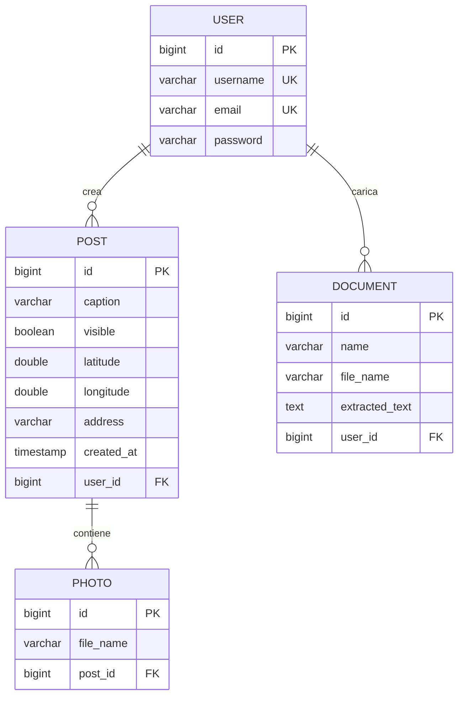
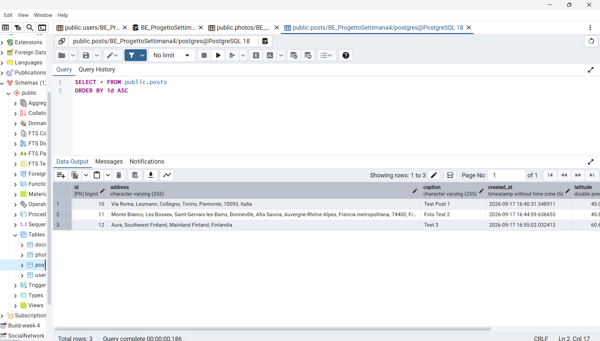
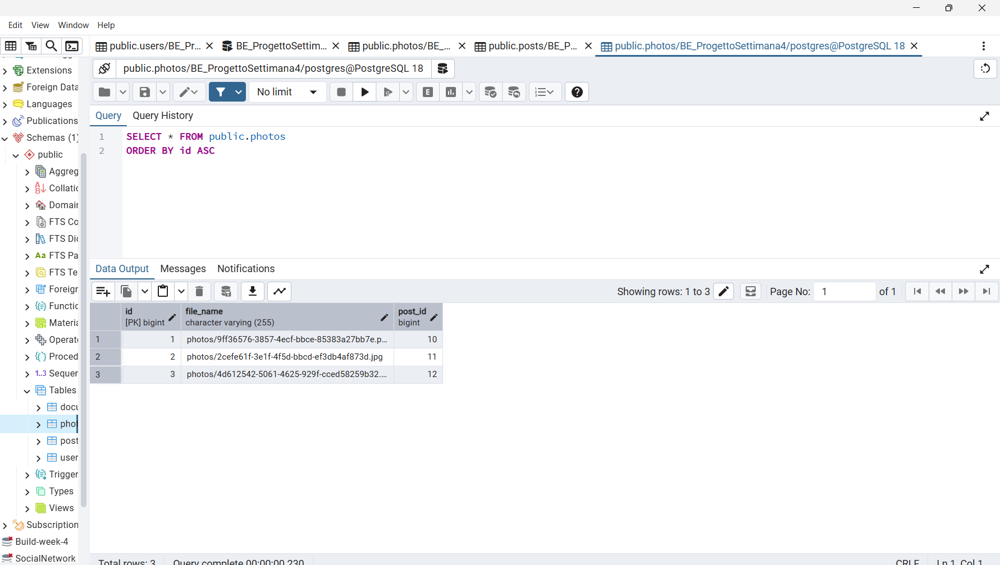
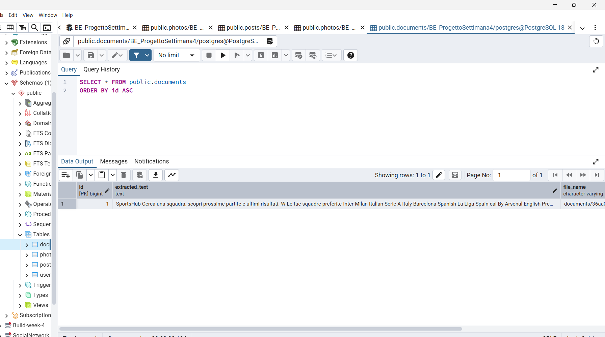
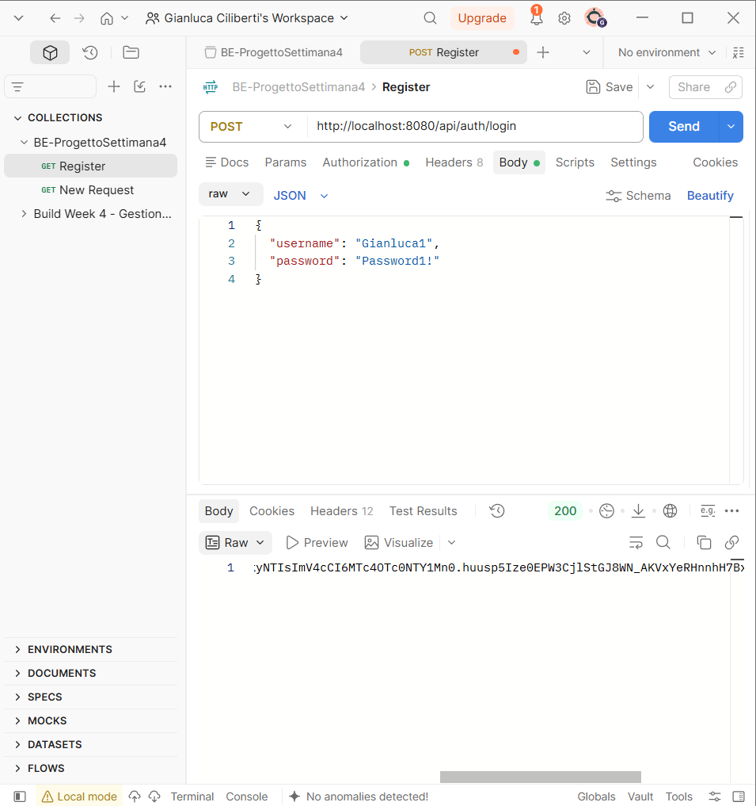

# Documentazione tecnica — InstagramClone

Documento di dettaglio delle scelte progettuali e implementative del progetto, a corredo del [README](../README.md) (che resta la panoramica rapida). Qui si entra nel merito di modello dati, controller/endpoint e modalità di implementazione delle funzionalità principali, con evidenze dirette da pgAdmin e Postman.

## Indice

1. [Modello del database](#1-modello-del-database)
2. [Struttura dei controller e endpoint API](#2-struttura-dei-controller-e-endpoint-api)
3. [Autenticazione JWT](#3-autenticazione-jwt)
4. [Upload dei file e storage](#4-upload-dei-file-e-storage)
5. [Post con più foto e geolocalizzazione](#5-post-con-più-foto-e-geolocalizzazione)
6. [OCR sui documenti](#6-ocr-sui-documenti)
7. [Librerie e servizi esterni](#7-librerie-e-servizi-esterni)

---

## 1. Modello del database

### Diagramma ER

`User` è l'entità radice: possiede più `Post` e più `Document` (relazioni `1 → N`, gestite lato JPA con `@ManyToOne` sulle entità figlie — non esistono collection inverse su `User`, le query "i miei post"/"i miei documenti" passano dai repository). Ogni `Post` possiede a sua volta una o più `Photo` (`@OneToMany` con `cascade = ALL` e `orphanRemoval = true`): eliminare un post elimina automaticamente le sue foto, sia a livello di riga sia — gestito esplicitamente nel service — come file fisici su disco.

La posizione geografica (`latitude`, `longitude`, `address`) è un attributo del `Post`, non della `Photo`: un post con più foto ha un'unica posizione condivisa, coerente con la richiesta della consegna.

### Screenshot pgAdmin

Contenuto reale delle tabelle, interrogate da pgAdmin (query `SELECT * FROM ...`), a conferma che lo schema descritto sopra corrisponde a quello effettivamente creato dal backend.

---

## 2. Struttura dei controller e endpoint API

| Controller | Responsabilità |
|---|---|
| `AuthController` | registrazione e login, emissione JWT |
| `UserController` | dati del profilo dell'utente autenticato |
| `PostController` | CRUD dei post (creazione multipart con foto, feed personale/pubblico, modifica metadati, eliminazione) |
| `DocumentController` | upload multipart dei documenti ed elenco con testo OCR |

| Metodo | Path | Body | Descrizione |
|---|---|---|---|
| POST | `/api/auth/register` | JSON | registrazione |
| POST | `/api/auth/login` | JSON | login, restituisce il JWT |
| GET | `/api/users/me` | — | profilo dell'utente autenticato |
| POST | `/api/posts` | multipart: `data` (JSON: caption, visible, latitude, longitude, address) + `photos[]` | crea un post con una o più foto |
| GET | `/api/posts` | — | post dell'utente autenticato |
| GET | `/api/posts/public` | — | feed dei post pubblici |
| PUT | `/api/posts/{id}` | JSON | modifica didascalia/visibilità/posizione di un post |
| DELETE | `/api/posts/{id}` | — | elimina un post, le sue foto e i relativi file |
| POST | `/api/documents` | multipart: `name` + `file` | carica un documento ed estrae il testo tramite OCR |
| GET | `/api/documents` | — | documenti dell'utente autenticato, con testo estratto |
| DELETE | `/api/documents/{id}` | — | elimina un documento e il relativo file |

Tutti gli endpoint tranne registrazione/login richiedono l'header `Authorization: Bearer <token>`. I file caricati sono serviti come risorse statiche sotto `/uploads/**` (endpoint pubblico, necessario perché i tag `` non possono allegare header custom).

### Screenshot Postman

`POST /api/auth/login`: risposta `200` con il JWT restituito come testo semplice, usato poi come `Authorization: Bearer <token>` per tutte le richieste autenticate.

Gli altri endpoint (creazione post multipart, feed pubblico, upload documento) sono stati verificati manualmente tramite il frontend React, che li utilizza tutti nel normale flusso applicativo.

---

## 3. Autenticazione JWT

1. `POST /api/auth/register` → `AuthService.register` normalizza username/email in minuscolo, verifica unicità (`UserAlreadyExistsException` → 409), salva la password con `BCryptPasswordEncoder`.
2. `POST /api/auth/login` → `AuthService.login` verifica le credenziali e genera un token firmato HMAC (`JwtService`, libreria `jjwt`), valido 24 ore, con lo username come subject.
3. Ogni richiesta successiva passa per `JwtAuthFilter` (estende `OncePerRequestFilter`, registrato prima di `UsernamePasswordAuthenticationFilter`): legge l'header `Authorization`, valida la firma/scadenza del token e, se valido, popola `SecurityContextHolder` con un `Authentication` il cui principal è lo username.
4. `SecurityConfig` impone `anyRequest().authenticated()` tranne per `/api/auth/register`, `/api/auth/login`, `/uploads/**` e le richieste `OPTIONS` (necessarie per il preflight CORS). Una richiesta senza token valido riceve `403` dal comportamento di default di Spring Security (nessun `AuthenticationEntryPoint` custom configurato).

## 4. Upload dei file e storage

`FileStorageService` è il punto unico di gestione dei file, usato sia da `PostService` sia da `DocumentService`:

- valida **estensione** (`jpg`, `jpeg`, `png`, `webp`) e **content-type** dichiarato dal client, rifiutando tutto il resto con `InvalidFileException` → `400` (gestita da `GlobalExceptionHandler`)
- genera un nome file univoco (`UUID`) per evitare collisioni, mantenendo l'estensione originale
- salva sotto una cartella locale configurabile (`app.upload.dir=uploads`, esclusa dal versionamento)
- espone `delete(path)`, usata quando un post o un documento vengono eliminati, per rimuovere anche il file fisico e non lasciare file orfani

I file sono serviti staticamente da `WebConfig` (`WebMvcConfigurer.addResourceHandlers`), che mappa `/uploads/**` alla cartella fisica.

La stessa whitelist di formati è applicata **anche lato frontend**, prima dell'invio (in `PostForm` e nel form di upload documenti), per dare un feedback immediato senza dover attendere la risposta del server.

## 5. Post con più foto e geolocalizzazione

Un post viene creato con una richiesta `multipart/form-data` che combina due parti: `data` (un blob JSON con didascalia, visibilità e posizione) e `photos` (una o più parti file). Lato frontend, `PostForm` offre due modalità per allegare le foto:

- **Carica foto**: `<input type="file" multiple>`, selezione di uno o più file
- **Scatta foto**: `<input type="file" capture="environment">`, cattura diretta da fotocamera (singola foto)

La posizione è scelta tramite `LocationPicker`: una mappa **Leaflet** (tile OpenStreetMap) su cui si può cliccare per posizionare un marker trascinabile, oppure un campo testuale che interroga **Nominatim** (geocoding) per cercare un indirizzo — con reverse-geocoding automatico ogni volta che il marker viene spostato. La posizione è sempre facoltativa.

## 6. OCR sui documenti

Al momento dell'upload di un documento, `DocumentService`:

1. salva il file tramite `FileStorageService`
2. passa il file a `OcrService`, che incapsula un'istanza di `net.sourceforge.tess4j.Tesseract`, configurata via `application.properties` (`tesseract.datapath`, puntato alla cartella `tessdata` dell'installazione locale di Tesseract; `tesseract.language=ita+eng`)
3. salva il testo restituito nel campo `extractedText` del documento

L'estrazione è **sincrona**: la risposta HTTP dell'upload contiene già il testo riconosciuto, senza bisogno di un secondo polling lato frontend.

## 7. Librerie e servizi esterni

| Libreria/servizio | Uso |
|---|---|
| Spring Security + `jjwt` | autenticazione stateless via JWT |
| Spring Data JPA / Hibernate | ORM, mapping delle entità, generazione schema (`ddl-auto=update`) |
| PostgreSQL | database relazionale |
| **Tess4J** | OCR (estrazione testo dai documenti caricati) — motore Tesseract incluso nel jar, richiede solo i dati linguistici (`tessdata`) installati localmente |
| **Leaflet / react-leaflet** | rendering della mappa interattiva nel frontend |
| **Nominatim (OpenStreetMap)** | geocoding/reverse-geocoding, servizio pubblico gratuito, nessuna API key richiesta |
